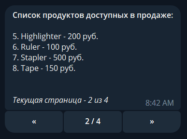
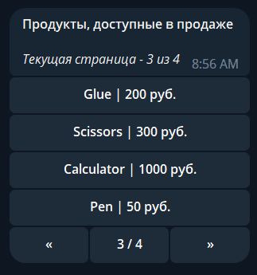
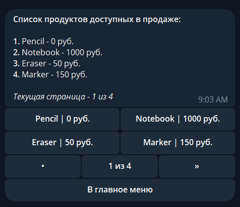

# Paginator Library

**Aiogram Customizable Paginator** is a Python library that provides functionality for paging through a list of objects. It allows you to easily navigate through the list using inline buttons.

## Installation

Use the package manager pip to install Aiogram Customizable Paginator.

```bash
pip install git+https://github.com/BathrisT/aiogram-customizable-paginator
```

## Использование

Чтобы Paginator работал, необходимо зарегистрировать CallbackQuery handler для перелистывания страниц. Делается это подобным образом:
```python
from aiogram import Bot, Dispatcher
from aiogram_customizable_paginator.pagination import register_paginator

async def main():
    bot = Bot(token='YOUR_BOT_TOKEN')
    dp = Dispatcher(bot)
    
    register_paginator(dp) # <-- Регистрация paginator
    
    try:
        await dp.start_polling()
    finally:
        await dp.storage.close()
        await dp.storage.wait_closed()
        await bot.session.close()
```

Далее, чтобы создать paginator, нужно создать объект класса `Paginator` передав нужные параметры (они описываются ниже), и вызвать метод `paginator.send_message()` с передачей id чата и объекта бота:
```python
from aiogram import Bot, Dispatcher
from aiogram.types import Message

from aiogram_customizable_paginator.pagination import register_paginator, Paginator

testing_products_database = [
    {'product_id': 1, 'name': 'Pencil', 'price': 0},
    {'product_id': 2, 'name': 'Notebook', 'price': 1000},
    ...
]


async def open_products_list(message: Message):
    paginator = Paginator(
        objects=testing_products_database,
        page_size=4,
        get_row_text_from_object_func=lambda obj, index: f'*{index + 1}.* {obj["name"]} - {obj["price"]} руб.',
        formatted_text_for_page=('*Список продуктов доступных в продаже:*\n\n'
                                 '{rows_text}\n'
                                 '___Текущая страница - {page_number} из {pages_count}___')
    )
    await paginator.send_message(chat_id=message.chat.id, bot_instance=message.bot)

async def main():
    bot = Bot(token='YOUR_BOT_TOKEN')
    dp = Dispatcher(bot)
    register_paginator(dp)
    dp.register_message_handler(open_products_list, commands=['products'])
```
_paginator.send_message() возвращает отправленное сообщение._<br/>

В указанном примере отправляется **новое сообщение** с paginator'ом. Мы так же можем **редактировать уже созданное сообщение,** чтобы сделать его paginator'ом (особенно полезно это в различных inline-меню). Делается это аналогично, только вместо вызова `paginator.send_message()` мы будем вызывать `paginator.edit_message()` с передачей туда chat_id, message_id и объекта бота:
```python
async def open_products_list1(callback: CallbackQuery):
    paginator = Paginator(
        objects=testing_products_database,
        page_size=4,
        get_row_text_from_object_func=lambda obj, index: f'*{index + 1}.* {obj["name"]} - {obj["price"]} руб.',
        formatted_text_for_page=('*Список канцтоваров доступных в продаже:*\n\n'
                                 '{rows_text}\n'
                                 '___Текущая страница - {page_number} из {pages_count}___'),
        ending_kb_elements=[[InlineKeyboardButton(text='Назад', callback_data='products_list')]]
    )
    await paginator.edit_message(
        chat_id=callback.message.chat.id,
        message_id=callback.message.message_id,
        bot_instance=callback.bot
    )
```
Посмотреть более подробный пример этого случая [можно здесь](./examples/example_4.py)

## Параметры
### objects:
List of objects that will be used for display on the page. Объекты могут быть любого типа, функции для работы с ними вы задаете в передаваемых параметрах, которые описаны далее. <br/>
Использование в примере выше: `objects=testing_products_database`
### get_row_text_from_object_func:
Функция для получения строки из объекта. **Используется для формирования текстового списка, который будет отображаться в сообщении.**
Первым аргументом функция принимает объект, вторым - его индекс, возвращает строку. 
Если текстовый список в сообщении не будет использоваться, то можно не задавать этот параметр.<br/>
Использование в примере выше: `get_row_text_from_object_func=lambda obj, index: f'*{index + 1}.* {obj["name"]} - {obj["price"]} руб.'`
### get_button_text_from_object_func:
**Функция для получения текста из объекта, который будет отображаться на кнопках.** 
Первым аргументом функция принимает объект, вторым - его индекс, возвращает строку.
Если кнопки для каждого отдельного объекта в paginator'е не нужны, то можно не задавать этот параметр.<br/>
Пример: `get_button_text_from_object_func=lambda obj, index: f'{obj["name"]} | {obj["price"]} руб.'`

### get_callback_data_from_object_func:
**Функция для получения callback-данных для кнопки из объекта.** Эти callback-данные будут отправляться при нажатии на кнопку соответствующую объекту.
Первым аргументом функция принимает объект, вторым - его индекс, возвращает строку.
Если кнопки для каждого отдельного объекта в paginator'е не нужны, то можно не задавать этот параметр.<br/>
Пример: `get_callback_data_from_object_func=lambda obj, index: f'open_product_{obj["product_id"]}'`

### formatted_text_for_page:
**Это текст, который будет отображаться в сообщении**.
В тексте в фигурных скобках можно задать следующие параметры:

- rows_text - сформированный текст со строками для отображения на странице
- page_number - номер текущей страницы
- pages_count - количество страниц
<br/>

Пример:
```python
formatted_text_for_page=('*Список продуктов доступных в продаже:*\n\n'
                         '{rows_text}\n'
                         '___Текущая страница - {page_number} из {pages_count}___')
```

### formatted_text_for_button_of_current_page:
Текст, который будет отображаться на средней кнопке paginator'а,
В тексте в фигурных скобках можно задать следующие параметры:
- page_number - номер текущей страницы
- pages_count - количество страниц
<br/>

Пример: `formatted_text_for_button_of_current_page='{page_number} из {pages_count}'`

### starting_page:
Индекс страницы, откуда запустится paginator. По умолчанию это 0

### page_size:
Количество элементов на странице

### buttons_row_size:
Количество элементов в одной строке inline-кнопок. По умолчанию 1.

### symbol_left: 
Символ отображаемый на inline-кнопке листания влево
### symbol_right: 
Символ отображаемый на inline-кнопке листания вправо
### symbol_fill: 
Символ отображаемый на inline-кнопках листания влево или вправо когда листать больше нельзя
### parse_mode:
parse_mode который будет использоваться в paginator'е

## Примеры со скриншотами
[Первый пример](./examples/example_1.py)<br/>

<br/>
[Второй пример](./examples/example_2.py)<br/>

<br/>
[Третий пример](./examples/example_3.py)<br/>

<br/>
[Четвертый пример](./examples/example_3.py)<br/>
_В четвертом примере вместо отправки paginator'а в новом сообщении мы редактируем старое_